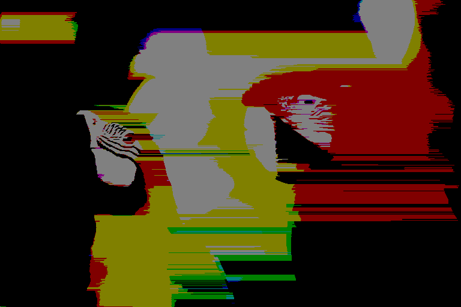

# 量化器

## 量化
用一个很小的集合表示一个大集合（可能是无限大）的值。

- 如A/D转换
- 量化是有失真压缩的一个有效工具


## 量化器的描述

量化误差：$e(x)=x-\hat x$

量化的均方误差
- 所有输入值的平均量化误差
- 需要知道输入的概率分布

- 量化区间的数目：$M$
- 决策边界：$b_i, i=0,1,...,M$
- 重构水平：$y_i, i=0,1,...,M$
- 重构：$\hat x = y_i ,\quad  if \quad b_{i-1} \lt x \lt= b_i $

均方误差：
$$
D = MSE =\int_{-\infty}^{+\infty}(x-\hat x )^2 f(x) d x= \sum_{i=1}^{M} \int_{b_{i-1}}{b_i}(x-y_i)^2f(x) dx
$$

量化器的设计是**码率**和**失真**之间的折衷，更低的编码比特数，需要减低量化区间的数目，导致更大的误差。

量化器的性能受率失真理论控制
- 给定允许失真，求最小码率的量化器
- 给定码率，求最小失真的量化器


## 均匀量化（Uniform Quantizer）（Midrise，中升型）

**均匀**：每个量化区间的大小相同，除两侧的两区间外。

- $b_i$，$y_i$在空间上均匀分布，空间均为$\Delta$
- 对内部区间，$y_i = \frac{1}{2}(b_{i-1} + b_i)$

### 量化映射
$$
q = A(x) = sign(x) \lfloor{\frac{|x|}{\Delta} + 0.5}\rfloor
$$

### 反量化映射
$$
\hat x = B(q) = q\Delta
$$


假设输入信源为均匀分布：$[-X_{max}, X_{max}]: f(x) = \frac{1}{2}X_{max}$

量化区间的数目为$M$

步长：$\Delta = \frac{2X_{max}}{M}$

量化误差：$e = x - \hat x$在区间$[-\Delta/2, \Delta/2]$上均匀分布。

$$
D = M\frac{1}{M\Delta}\int_{0}^{\Delta}(x - \frac{\Delta}{2})^2 dx = \frac{1}{\Delta}\frac{1}{12}\Delta^3 = \frac{1}{12}\Delta^2
$$

# 预测编码：DPCM（差分脉冲编码调制）

DPCM系统框图：


上图中的量化器，之所以要在输入反馈前进行量化，是为了防止量化误差的累积。

$\hat x$ 表示对$x_k$的预测，在此$\hat x = x'_{k-1}$
$$
x_k - x'_k = (\hat x_k + e_k) - (\hat x_k + e_k)) = e_k - \hat e_k
$$

DPCM是一个反馈系统，

1. 从输入数据流中获取值
2. 计算与前一值的反量化重建值的差
3. 

一阶DPCM的代码（包含量化和反量化）
```c
// 量化器
char q_1(short src)
{
    double delta = DELTA;
    return (char) (src/delta + 0.5);
}

// 反量化器
short inv_q_1(char src)
{
    double delta = DELTA;
    return ((short) src)*delta; 
}

// 输入是一个8比特值，
void dpcm(BYTE *buf_in, BYTE * buf_out, int size){
    short predict = buf_in[0];      // 将输入数据的第一个值作为基准电平
    char predict_q = q_1(predict_q);    // 对第一个值量化
    short predict_inv = inv_q_1(predict_q);   // 再做反量化，作为重建值
    short rebuild = predict_inv + 0;    // 将第一个反量化得到的值作为第一个重建值
    buf_out[0] = predict_q; // 将预测值放入输出结果

    for(int i=1;i<size;i++){
        predict = rebuild - buf_in[i];  // 计算当前值与前一重建值间的差，得到预测值，这里只做了系数为1的一阶预测
        predict_q = q_1(predict);       // 对预测值进行量化
        predict_inv = inv_q_1(predict_q);   //  预测值反量化
        buf_out[i] = predict_q;     // 将预测值放入输出结果
        rebuild = rebuild - predict_inv;    // 计算重建值
        //printf("%d \t%d \t%d %d\r\n", predict, buf_in[i], predict_q, predict_inv);
    }
}
```


## 预测与量化的优化

在理想情况下，预测器与量化器应当共同优化。但实际中由于系统本身是一个反馈系统，让二者的共同优化变得困难。

因此采用一种次优化的方法：认为量化器的量化电平数足够大，只优化预测器。（一般$M \ge 8$才能获得好的性能）

$$
SNR = \frac{E[S^2(k)]}{e^2(k)}=\frac{E[S^2(k)]}{d^2(k)} \frac{E[d^2(k)]}{e^2(k)} = G_p SNR_q
$$

其中，$E[e^2(k)]$为量化误差均方值，$E[d^2(k)]$为预测误差均方值。

# 实验：BMP图片DPCM量化编码

采用固定预测器和均匀量化器。预测器采用左侧、上方预测均可，量化器采用8比特均匀量化。通过实验，验证DPCM编码的编码效率。首先读取一个256级的灰度图像，采用自己设定的预测方法计算预测误差，并对预测误差进行8比特均匀量化，还可以对预测误差进行1比特、2比特和4比特的量化设计。

要验证DPCM的编码效率，将生成的DPCM编码的文件输入Huffman编码器，得到输出码流，给出概率分布图并计算压缩比。

比较
1. DPCM + 熵编码
2. 仅进行熵编码

的编码效率。

编码效率以压缩比和图像质量来衡量，图像质量以PSNR计算。

256级灰度的图像，单个像素的每个通道为8比特，经过DPCM量化，实际范围扩展为9比特，再将9比特的预测误差经过8比特均匀量化。

量化器和预测器的代码已在前文给出。

## 实验结果

### 8bit量化

| 图片|原图| 原体积(B) | 熵编码(B) | 压缩比|DPCM+熵编码| 压缩结果| 压缩比|PSNR|
|-|-|-|-|-|-|-|-|-|
|Birds||1179702|1124467|0.9532|468569||0.3972|3.065
|Camman256B||66614|60093|0.9021|34029||0.5108|1.495
|Clown256B||66614|65093|0.9772|41079||0.6167|2.687
|Fruit256B||66614|65138|0.9778|35932||0.5394|5.65
|Lena256B||196662|187495|0.9534|112118||0.5701|0.02336
|Noise256B||66614|61331|0.9207|65200||0.9788|20.93
|Odie256B||66614|12590|0.189|10931||0.1641|9.511
|Zone256B||66614|64985|0.9755|65665||0.9858|5.018


在DPCM+8bit量化下，图像质量的损失肉眼几乎不可见。但是在熵编码下，一般的图像（除Noise和Zone外）均取得了非常明显的压缩率的提升，提升比例在40%~50%，这是因为这些图像在空间上均具有比较大的冗余；而Noise和Zone图像，因为这两张图专门作为低空间冗余度的例子而构造的，因此DPCM的效果十分有限。

因为具有比较高的量化电平数（M=8），因此量化误差对于DPCM的影响很小，对图像质量的影响很小。

### 4bit

| 图片|原图| 原体积(B) | 熵编码(B) | 压缩比|DPCM+熵编码| 压缩结果| 压缩比|PSNR|
|-|-|-|-|-|-|-|-|-|
|Birds||1179702|1124467|0.9532|158672||0.1345|-9.843
|Camman256B||66614|60093|0.9021|12455||0.187|-11.6
|Clown256B||66614|65093|0.9772|12715||0.1909|-11.29
|Fruit256B||66614|65138|0.9778|11762||0.1766|-9.842
|Lena256B||196662|187495|0.9534|31337||0.1593|-13.02
|Noise256B||66614|61331|0.9207|31011||0.4655|-12.72
|Odie256B||66614|12590|0.189|10844||0.1628|-7.076
|Zone256B||66614|64985|0.9755|32283||0.4846|-9.977

在压缩结果中，可以明显的看到横向的条纹，这是因为使用了比较少的量化电平数导致的，量化误差对于DPCM来说难以忽略，因此产生了比较大的噪声。

### 2bit

| 图片|原图| 原体积(B) | 熵编码(B) | 压缩比|DPCM+熵编码| 压缩结果| 压缩比|PSNR|
|-|-|-|-|-|-|-|-|-|
|Birds||1179702|1124467|0.9532|148596||0.126|-16.51
|Camman256B||66614|60093|0.9021|10413||0.1563|-15.14
|Clown256B||66614|65093|0.9772|10499||0.1576|-16.4
|Fruit256B||66614|65138|0.9778|10295||0.1545|-15.27
|Lena256B||196662|187495|0.9534|25107||0.1277|-15.63
|Noise256B||66614|61331|0.9207|13061||0.1961|-16.98
|Odie256B||66614|12590|0.189|10438||0.1567|-16.5
|Zone256B||66614|64985|0.9755|14982||0.2249|-16.0


实际实验中，2bit仅保持了两个电平，1bit量化的结果是全黑，可能是参数计算上有问题。可能这个是1bit量化结果，下面是0bit量化结果。

### 1bit

| 图片|原图| 原体积(B) | 熵编码(B) | 压缩比|DPCM+熵编码| 压缩结果| 压缩比|PSNR|
|-|-|-|-|-|-|-|-|-|
|Birds||1179702|1124467|0.9532|147506||0.125|-13.95
|Camman256B||66614|60093|0.9021|10140||0.1522|-14.58
|Clown256B||66614|65093|0.9772|10140||0.1522|-13.83
|Fruit256B||66614|65138|0.9778|10140||0.1522|-13.6
|Lena256B||196662|187495|0.9534|24627||0.1252|-14.58
|Noise256B||66614|61331|0.9207|10140||0.1522|-13.76
|Odie256B||66614|12590|0.189|10140||0.1522|-13.12
|Zone256B||66614|64985|0.9755|10140||0.1522|-11.63


## 总结

实验的多数时间花费在处理BMP文件中，给出的示例照片包含两种不同的BMP像素格式：8bit和24bit，其中，8bit格式使用8位地址的颜色查找表，24bit则是原始的RGB像素。

为了方便计算测试结果，编写了一个Python脚本用于执行测试流程、计算并输出各项指标：

```python
from cProfile import label
from mimetypes import init
import ctypes as C
import os
import sys

os.system("gcc -o ./build/cmp.so -I ./lib/include --share -fPIC ./cmp.c ./lib/src/*")
print("Compare")
dll = C.CDLL("./build/cmp.so")
dll.cmp.restype = C.c_double
dll.cmp.argtypes = [C.c_char_p, C.c_char_p]
PSNR = dll.cmp(b"./test/Birds.bmp", b"./test/test_out/bit_2/Birds/Birds.dpcm.dhuff.bmp")
print(PSNR)

def calc_psnr(path_a:str, path_b:str):
    return dll.cmp(path_a.encode(encoding="utf-8"), path_b.encode(encoding="utf-8"))

huff_bin = "./Huffman_test/huff_run.exe"

bits = 1
D = 9 - bits
bmps = ["Birds", "Camman256B", "Clown256B", "Fruit256B", "Lena256B", "Noise256B", "Odie256B", "Zone256B"]
BASE_PATH = "./test"
BASE_OUT_PATH = f"{BASE_PATH}/test_out/bit_{bits}"
MD_BASE_URL = ""

os.system(f"mkdir -p {BASE_OUT_PATH}")
report_file = open(f"{BASE_OUT_PATH}/report.csv", "w+")
md_file = open(f"{BASE_OUT_PATH}/report.md", "w+")
md_file.write("| 图片|原图| 原体积(B) | 熵编码(B) | 压缩比|DPCM+熵编码| 压缩结果| 压缩比|PSNR|\r\n|-|-|-|-|-|-|-|-|-|\r\n")
class Test:
    def __init__(self, name:str, d:int) -> None:
        self.d = d
        self.name = name
        self.test_file_out_dir = f"{BASE_OUT_PATH}/{name}"
        self.input_bmp_file_path = f"{BASE_PATH}/{name}.bmp"
        self.output_dpcm_file_path = f"{self.test_file_out_dir}/{name}.dpcm"
        self.output_dpcm_huff_path = f"{self.output_dpcm_file_path}"
        self.output_huff_path = f"{self.test_file_out_dir}/{name}"
        pass

    def excute(self):
        os.system(f"mkdir -p {self.test_file_out_dir}")
        os.system(f"rm {self.test_file_out_dir}/* -Rf")
        os.system(f"echo start")
        os.system(f"./build/main {self.input_bmp_file_path} {self.output_dpcm_file_path} {self.d}")


        os.system(f"wine {huff_bin} -i {self.output_dpcm_file_path} -o {self.output_dpcm_file_path}.huff -c -t {self.output_dpcm_file_path}.txt")
        os.system(f"wine {huff_bin} -i {self.input_bmp_file_path} -o {self.output_huff_path}.huff -c -t {self.output_huff_path}.txt")

        os.system(f"wine {huff_bin} -i {self.output_dpcm_file_path}.huff  -o {self.output_dpcm_file_path}.dhuff -d")
        os.system(f"./build/main_d {self.output_dpcm_file_path}.dhuff {self.output_dpcm_file_path}.dhuff.bmp {self.d}")

        os.system(f"ls -l {self.test_file_out_dir}")

    def result(self):
        origin_size = os.path.getsize(self.input_bmp_file_path)
        origin_huff_size = os.path.getsize(f"{self.output_huff_path}.huff")
        origin_huff_rate = origin_huff_size/origin_size
        dpcm_huff_size = os.path.getsize(f"{self.output_dpcm_huff_path}.huff")
        dpcm_huff_rate = dpcm_huff_size/origin_size
        res = f"{self.name}\t{origin_size}\t{origin_huff_size}\t{origin_huff_rate:.4}\t{dpcm_huff_size}\t{dpcm_huff_rate:.4}"
        report_file.write(res + "\r\n")

        md_img = lambda p:f"";        
        dpcm_out_md = md_img(self.output_dpcm_file_path + ".dhuff.bmp")

        PSNR = calc_psnr(self.input_bmp_file_path, self.output_dpcm_file_path + ".dhuff.bmp")
        md_chart = f"|{self.name}|{md_img(self.input_bmp_file_path)}|{origin_size}|{origin_huff_size}|{origin_huff_rate:.4}|{dpcm_huff_size}|{dpcm_out_md}|{dpcm_huff_rate:.4}|{PSNR:.4}\r\n"
        md_file.write(md_chart)


for bmp in bmps:
    test = Test(bmp, D)
    test.excute()
    test.result()
```